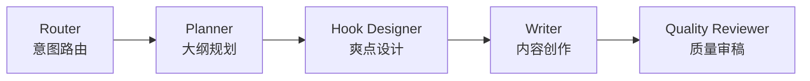

<div align="center">


# ZenStory

**对话即创作 — AI Agent 驱动的商业级小说写作工作台**

[](LICENSE)
[](https://github.com/zenstory-ai/zenstory)
[](https://zenstory.ai/)

ZenStory 让 AI Agent 直接操作你的创作文件——建角色卡、拆参考素材、规划大纲、逐章写作——全部在一次对话里完成。

**2000+ 创作者 · 1200 万字生成 · 4.9 分好评**

[zenstory.ai](https://zenstory.ai/) · [快速开始](#快速开始) · [English](README_EN.md)

</div>

---

<table>
  <tr>
    <td></td>
  </tr>
  <tr>
    <td align="center"><b>三栏工作台 — 文件树 · 编辑器 · AI 对话，AI 直接读写你的创作文件</b></td>
  </tr>
</table>

## 目录

- [为什么是 ZenStory](#为什么是-zenstory) — 与传统 AI 写作工具的差异
- [核心能力](#核心能力) — 8 大能力详解（对话操作文件 · 多 Agent · 素材库 · 技能 · Agent API …）
- [快速开始](#快速开始) — Docker 一行启动
- [项目架构](#项目架构) — Monorepo 一览
- [路线图](#路线图) — 已交付能力与后续计划
- [参与贡献](#参与贡献) — 提交 Bug / 功能建议 / PR

## 为什么是 ZenStory

市面上的 AI 写作工具大多停留在"聊天框 + 复制粘贴"。ZenStory 把 AI 变成真正动手的创作搭档：

| 传统 AI 写作工具 | ZenStory |
|:---|:---|
| 聊天框 + 复制粘贴 | Agent 直接创建、编辑、组织你的创作文件 |
| 无上下文记忆，每次从零开始 | 理解角色关系、世界观约束，写出不穿帮的连贯内容 |
| 单一模型一问一答 | 多 Agent 协作流水线（规划 → 设计 → 创作 → 审稿） |
| 灵感枯竭时无从下手 | AI 拆解参考作品 + 上下文感知的灵感推荐 |
| 封闭，无法对接外部工具 | Agent API 支持 Claude Code / OpenClaw 等工具直连 |

## 核心能力

### 1. 对话 × 文件系统 — 全新创作范式

AI 通过一套完整工具链，直接操作你的创作文件：

<table>
  <tr>
    <td align="center"><b>AI 对话驱动创作</b></td>
    <td align="center"><b>智能文件树管理</b></td>
  </tr>
  <tr>
    <td></td>
    <td></td>
  </tr>
</table>

- **对话即操作** — "帮我创建一个反派角色，性格阴沉但有悲情过往"，Agent 自动新建角色卡并填充设定
- **上下文感知** — AI 理解角色关系、世界观规则、已有章节内容，写出连贯不穿帮的文字；长对话自动压缩上下文，不丢主线
- **Diff 审阅模式** — AI 的修改先以差异对比呈现，确认后再应用，掌控权始终在你手里
- **流式生成 + 实时介入** — 实时看到 AI 逐字创作，生成过程中也能随时插话调整方向
- **9 种 Agent 工具** — 创建 / 编辑 / 删除文件、检索文件、混合检索素材、更新项目状态、Agent 交接、请求澄清、并行执行，覆盖创作全流程

### 2. 多 Agent 协作写作引擎

一个意图路由器 + 四个专职 Agent，组成一支完整的 AI 写作团队（完全自研编排）：



| 角色 | 职责 | 何时介入 |
|------|------|---------|
| **Router** | 意图识别，选择最优工作流 | 每次请求 |
| **Planner** | 规划故事结构，拆解章节节奏 | 复杂创作任务 |
| **Hook Designer** | 设计情节转折、悬念与高潮 | 需要强化吸引力时 |
| **Writer** | 专注内容创作，风格自适应 | 所有创作任务 |
| **Quality Reviewer** | 一致性检查、质量把关 | 长内容自动触发 |

Router 自动判断任务复杂度，在 **五种工作流**——快速直写 · 标准流程 · 完整协作 · 转折专攻 · 纯审稿——之间匹配最优路径。Agent 之间支持智能交接（handoff），实现真正的多轮协作。

### 3. 素材库 — AI 拆解参考作品

上传你欣赏的参考小说，AI 自动拆解为 **8 类结构化创作元素**：

| 拆解维度 | 说明 |
|---------|------|
| **章节摘要** | 每章核心事件与情节推进 |
| **角色档案** | 人物名称、别名、性格原型、能力体系 |
| **角色关系** | 人物间的复杂关系网络 |
| **情节点** | 每章关键事件（冲突 / 转折 / 揭示 / 对话） |
| **故事线** | 跨章聚合的完整剧情弧（起承转合） |
| **世界观** | 力量体系、世界结构、关键势力 |
| **金手指** | 特殊能力系统的名称、类型、进化历程 |
| **时间线** | 事件发生的时序排列 |

拆解后的素材通过 **混合检索（RAG）** 精准定位——向量语义 + 关键词双引擎按 RRF 融合排序，在海量素材中秒级找到相关片段。AI 写作时自动引用相关素材，确保风格和设定的一致性。

### 4. 灵感库 — 打破创作瓶颈

<table>
  <tr>
    <td></td>
  </tr>
  <tr>
    <td align="center"><b>基于项目上下文的智能灵感卡片，一键复制到项目启动创作</b></td>
  </tr>
</table>

- **上下文感知** — 基于你的项目类型（长篇 / 短篇 / 短剧）和已有内容生成精准灵感
- **精选推荐** — 编辑精选的高质量灵感模板，覆盖各类型创作场景
- **一键复用** — 看中灵感直接复制到项目，立即开始创作
- **素材联动** — 你的素材库越丰富，灵感推荐越精准

### 5. 技能系统 & 市场

13 个内置专业写作技能，开箱即用：

| 分类 | 技能 |
|------|------|
| **写作** | 继续写作 · 场景描写 · 对话生成 · 开头创作 |
| **情节** | 冲突设计 · 悬念设计 · 反转设计 · 节奏控制 |
| **风格** | 沉浸增强 · 文本润色 |
| **设定** | 角色创建 · 大纲生成 · 世界观构建 |

<table>
  <tr>
    <td></td>
  </tr>
  <tr>
    <td align="center"><b>技能市场 — Markdown 定义技能，一键分享，社区共建</b></td>
  </tr>
</table>

技能以 Markdown 定义，支持自定义创建与一键分享到市场；配合管理审核机制，社区共建、越用越强。

### 6. Agent API — 让外部 AI 工具直连创作空间

生成 API Key，粘贴到 Claude Code 或 OpenClaw，外部 AI Agent 即可直接读写你的小说项目：

```text
# 在 Claude Code 或 OpenClaw 中，Agent 可以：
# - 读取项目文件和角色设定
# - 创建新章节和角色
# - 检索素材库
# - 编辑已有内容
```

API Key 支持哈希存储与按项目授权，实现 **AI 生态互联**——你喜欢的任何 AI 工具都能成为 ZenStory 的创作引擎。

### 7. 专业写作工作台

<table>
  <tr>
    <td align="center"><b>Tiptap 富文本编辑器</b></td>
    <td align="center"><b>版本对比与回滚</b></td>
  </tr>
  <tr>
    <td></td>
    <td></td>
  </tr>
</table>

- **六种文件类型** — 大纲、草稿、剧本、角色、世界观、片段，各类型独立编辑界面
- **智能排序** — 自动识别中英文章节编号（"第一章" / "Chapter 1"），按序排列
- **版本快照** — 每次编辑自动保存，一键对比任意两个版本的差异，支持回滚
- **多格式导出** — 一键导出纯文本（TXT），章节自动按序合并
- **语音输入** — 语音转文字（腾讯云 ASR），长按录音，移动端友好
- **全局搜索** — Cmd+K 快速搜索项目内所有文件
- **深色模式** — 护眼写作，自动跟随系统偏好
- **中英双语** — 界面全面国际化

### 8. 商业级运营能力

ZenStory 是一套可直接运营的完整产品：

- **订阅体系** — Free / Pro 多档套餐，套餐目录可动态配置
- **配额管理** — 写作字数、Agent 任务数、项目数、素材上传量精细控制
- **积分系统** — 每日签到、邀请奖励、兑换码，积分可兑换订阅时长
- **写作连续** — 追踪每日写作，连续打卡，冻断保护
- **数据统计** — 字数趋势、章节完成度、AI 协作分析、项目健康度
- **管理后台** — 用户管理、订阅管理、技能审核、Prompt 编辑、数据看板
- **项目类型** — 长篇小说、短篇小说、短剧剧本三种创作路径，各有专属引导

## 快速开始

只需一个 DeepSeek API Key，一行命令启动：

```bash
export DEEPSEEK_API_KEY=your-key
docker compose up -d --build
```

前端 http://localhost:5173 · API 文档 http://localhost:8000/docs

> 本地开发详见 [CONTRIBUTING.md](CONTRIBUTING.md)；生产部署（PostgreSQL + Redis）详见 [docs/docker-compose.md](docs/docker-compose.md)。

## 项目架构

Monorepo：React 前端（`apps/web`）+ FastAPI 后端（`apps/server`），文件是核心创作单元，AI 对话驱动内容生成。AI Agent 系统在 `apps/server/agent`。

> Agent 系统的详细架构（多 Agent 工作流、工具、SSE 事件）见 [`apps/server/agent/CLAUDE.md`](apps/server/agent/CLAUDE.md)。

## 路线图

- [x] 多 Agent 协作写作引擎（Router / Planner / Hook Designer / Writer / Quality Reviewer）
- [x] 素材库 AI 拆解（8 类结构化元素 + 混合 RAG 检索）
- [x] 灵感库（上下文感知 + 一键复用）
- [x] 技能系统 & 市场（13 个内置 + 自定义 + 社区分享）
- [x] Agent API（Claude Code / OpenClaw 直连）
- [x] 版本快照 & Diff 对比
- [x] 语音输入
- [x] 商业化（订阅 / 配额 / 积分 / 管理后台）
- [ ] 更多导出格式（Word / Markdown）
- [ ] 移动端原生 App

## 参与贡献

欢迎通过以下方式参与：

- [提交 Bug](https://github.com/zenstory-ai/zenstory/issues/new?template=bug_report.md)
- [功能建议](https://github.com/zenstory-ai/zenstory/issues/new?template=feature_request.md)
- 提交 Pull Request

请阅读 [CONTRIBUTING.md](CONTRIBUTING.md) 了解贡献流程。

## 许可证

[MIT License](LICENSE) &copy; 2024-2026 ZenStory
