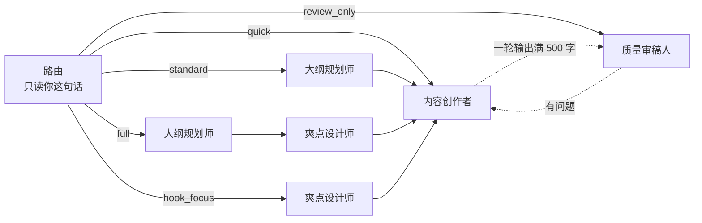

<p align="center">
  
</p>

<h1 align="center">ZenStory Workbench</h1>

<p align="center">
  <b>对话即创作：在浏览器里写小说，AI 直接新建、改写你的大纲、正文和角色卡。</b>
</p>

<p align="center">
  <a href="https://zenstory.ai/zh/workbench"><b>项目主页</b></a>
  &nbsp;·&nbsp;
  <a href="#开始使用"><b>开始使用</b></a>
  &nbsp;·&nbsp;
  <a href="#看看它的输出"><b>看看它的输出</b></a>
  &nbsp;·&nbsp;
  <a href="README_EN.md"><b>English</b></a>
</p>

<p align="center">
  <a href="https://github.com/zenstory-ai/zenstory/stargazers"></a>
  
  <a href="https://app.zenstory.ai/"></a>
  <a href="./LICENSE"></a>
</p>

<p align="center">
  <a href="https://app.zenstory.ai/"></a>
  <a href="https://github.com/zenstory-ai/zenstory/issues"></a>
</p>


左边文件树，中间编辑器，右边 AI 对话。

## 这是什么

ZenStory 工作台是一个在浏览器里写小说的地方。大纲、正文、角色卡、世界观、素材都是项目里的文件，你在右边和 AI 说话，AI 直接新建、改写这些文件，不用来回复制粘贴。可以在 [app.zenstory.ai](https://app.zenstory.ai) 在线用，也可以按 MIT 许可自己部署。

- **在对话里改文件**：说「帮我建一个反派，性格阴沉，有悲情过往」，Agent 会在「角色」文件夹里新建一张角色卡，边写边显示在编辑器里。续写、改写正文也一样，改动直接落进文件。
- **一个路由，四个专职 Agent**：路由只看你这一句话，从五条流程里选一条，再由大纲规划师、爽点设计师、内容创作者、质量审稿人接力。内容创作者一轮输出满 500 字并且写了文件，会自动交给审稿人；审稿人不能改文件，有问题交回去重写。
- **对话里的改动都留版本**：对话里的 AI 每改一次文件都存一个版本，对话里的编辑卡片可以一键撤销；你自己保存时，内容长度变化超过 10 个字才记版本；AI 一轮回复正常结束后，整个项目再拍一次快照。
- **每轮带上该带的资料**：在约 6000 token 的预算里，给 AI 带上「AI 记忆」的四栏（项目简介、写作风格、当前阶段、备注，太长会被截短）、项目文件清单、你正在编辑的文件、同一文件夹里的上一章和最近改过的几份文件，以及最近改过的角色和设定。
- **别的 Agent 也能接进来**：在设置里生成 API Key，把提示词发给 Claude Code、OpenClaw 这类 Agent，它们就能读写你的项目。

## 工作台里有什么

<table>
  <tr>
    <td></td>
    <td></td>
  </tr>
  <tr>
    <td align="center">打开章节，在右边写请求</td>
    <td align="center">长篇项目默认五个文件夹：设定、角色、素材、大纲、正文</td>
  </tr>
</table>

### 多 Agent 分工



| 流程 | 谁来做 | 什么时候走 |
| --- | --- | --- |
| quick | 内容创作者直接写 | 续写、扩写等日常请求，路由拿不准时也走这条 |
| standard | 先出大纲，再写 | 你要大纲、规划、梗概、章节结构 |
| full | 大纲 → 爽点设计 → 写作 | 你明确要完整流程、重要章节或高潮戏 |
| hook_focus | 先设计爽点、反转、节奏，再写 | 你说不够爽、太平淡、要反转 |
| review_only | 只审稿，不改文件 | 你要检查、评估、追更指数 |

输入框上可以切换「高质量」和「快速」两种模式，用的是同一个模型。「高质量」是默认：先走路由，写完按字数自动送审。「快速」不走路由，也关掉按字数自动送审，直接交给内容创作者；不过内容创作者的提示词仍要求把 500 字以上的稿子交给审稿人，所以还可能审一轮。

生成过程中还能在输入框追加指令。正在工作的 Agent 这一轮里看不到它；这一轮做完后，有下一个 Agent 就由下一个接着处理，没有就让当前 Agent 再补一轮按它调整。正在写的内容不会被打断。

### 13 个内置技能

| 分类 | 技能 |
| --- | --- |
| 写作 | 续写正文 · 场景描写 · 对话生成 · 开头生成 |
| 情节 | 创建大纲 · 冲突设计 · 钩子设计 · 反转设计 |
| 文风 | 代入感强化 · 润色修改 · 节奏控制 |
| 角色 | 创建角色 |
| 世界观 | 世界观设定 |

每个技能是一个 Markdown 文件（[`apps/server/agent/skills/builtin/`](apps/server/agent/skills/builtin/)），写着触发词和给 AI 的指令。在「技能 → 发现技能」里添加后就能用：在输入框打 `/` 选一个，或者在消息开头写技能名、触发词再加空格或标点（比如「钩子设计：给这章换个结尾」），这一条消息就按它来。什么都不写时，AI 可能自己用上一个技能，但每轮只附得下几个技能的完整指令（合计约 4000 字），其余的要在消息开头点名才生效。自己也能写技能，分享出去要经管理员审核才会公开。

### 版本、快照与导出


- 停笔约 3 秒自动保存。内容长度变化超过 10 个字时记一个版本；AI 的每次修改也各记一个，标成「AI 编辑」。
- 编辑器底部的「历史」按钮打开当前文件的版本：任选两个版本逐行比较，或把文件回滚到某个版本。回滚不删旧版本；版本额度没满时，回滚后的内容记成一个新版本。被替换掉的当前稿不会先另存，回滚前先确认它已经有版本。
- 顶栏的历史图标（提示「版本历史」）打开整个项目的快照列表：可以比较两次快照，也可以把整个项目回滚到某一次。快照记的是每个文件当时的最新版本，不另存正文，所以没记成版本的改动回滚后找不回；整项目回滚还会移除快照之后新建的文件。
- 「导出正文」把项目里的正文和剧本文件按章节顺序合成一个 TXT，大纲、角色卡和设定不在里面。

### 素材库与灵感库

- **素材库**：上传一本 TXT 参考小说（不超过 30 万字），后台拆出每章摘要、每章的情节点、角色档案、跨章剧情与故事线、世界观和金手指。AI 不会自己去翻素材库，要用时附加到对话或导入项目（见[常见问题](#ai-会自动参考素材库里的书吗)）。在线版里素材库是 Pro 权益。
- **灵感库**：官方上架的，以及用户投稿、经管理员审核通过的整套项目模板。点「使用此模板」会新建一个项目，把模板里的文件都复制进去。

### 其他

- 新建项目时选长篇小说、短篇小说或短剧剧本，三种的默认文件夹和 AI 收到的写作指引都不一样。
- 能把写好的稿子导进来，按章节标题自动拆成多个文件（见[常见问题](#能把已经写好的稿子导进来吗)）。
- `Cmd+K`（Windows 上 `Ctrl+K`）按标题搜索项目里的文件。
- 对话框里有语音输入（腾讯云一句话识别），识别出的文字填进输入框。
- 中文和英文界面；深色、浅色主题在设置里切换；手机浏览器里是「文件 / 编辑 / AI」三个底部标签。

## 开始使用

### 在线版

打开 [app.zenstory.ai](https://app.zenstory.ai)。注册时要填邀请码，找已经注册的朋友在「设置 → 邀请」里生成一个（见[常见问题](#在线版注册要邀请码去哪拿)）。免费版有每天 20 次 AI 对话、3 个项目，各套餐的对比见[定价页](https://app.zenstory.ai/pricing)。

新建一个「短篇小说」项目，第一条请求可以先要一份能改的提纲，不急着写正文（示例来自[快速开始](https://zenstory.ai/docs/getting-started/quick-start)）：

> 我想写一篇现实悬疑短篇。先只给三场景提纲，暂不写正文，也不要创建或修改文件。现在五点四十分，车站失物招领窗口六点关闭。值班员林禾处理沈敏对灰色帆布包的认领：她准确说出包的外观，却说错了内袋里的一件物品。不要直接认定她偷窃，也不要替我决定真相。林禾不能仅凭口头认领交付物品。每个场景写：地点、人物当下目标、可见行动、信息变化、场景结束时留下的问题。最后列出两个必须由我决定的故事选择，然后停止。

提纲定了，再点名文件让它落盘（第三行的「钩子设计：」要先在「技能 → 发现技能」里添加这个技能）：

```text
把刚才的三场提纲存成「构思」文件夹里的「失物招领 提纲」。
按「失物招领 提纲」写第一场，存成「正文」文件夹里的「第1场 认领」，写完这一场就停。
钩子设计：只改「第1场 认领」最后两段，给它换一个结尾钩子。
```

更多用法见[使用文档](https://zenstory.ai/docs)。

### 自己部署

需要 Docker 和一个 [DeepSeek API Key](https://platform.deepseek.com/api_keys)：

```bash
export DEEPSEEK_API_KEY=your-key          # 也可以写进仓库根目录的 .env
docker compose up -d --build

# 第一个账号：管理员，不需要邀请码和邮箱验证。
# 换成你自己的邮箱和密码，密码至少 12 位（CHANGE-ME 不够长，会被拒绝）
docker compose exec -e ZENSTORY_ADMIN_EMAIL=you@example.com \
  -e ZENSTORY_ADMIN_PASSWORD='CHANGE-ME' server python scripts/create_admin.py

# 可选：把 13 个内置技能导入「发现技能」
docker compose exec server python scripts/migrate_skills.py --db-url sqlite:////app/db/zenstory.db
```

打开 <http://localhost:5173> 登录，API 文档在 <http://localhost:8000/docs>。数据库是 SQLite，和上传文件、向量索引一起放在 Docker 卷里，`docker compose down` 和重新构建都不会清掉。

每个账号（包括管理员）默认都是免费套餐：每天 20 次 AI 对话、最多 3 个项目。要放开，先运行 `docker compose exec server python scripts/seed_subscription_plans.py` 创建 Pro 套餐（也会建好免费套餐这一行），再在管理后台「订阅管理」里给账号开通 Pro，或在「订阅计划」里改免费套餐的额度。

写作 Agent 固定用 DeepSeek 的 `deepseek-v4-flash`，只需要这一个 Key。其他功能各要各的配置：用上面的快速启动时，后端变量加到 `docker-compose.yml` 里 `server` 的 `environment` 下，`VITE_*` 加到 `web` 下，再运行 `docker compose up -d`；仓库根目录的 `.env` 只给 compose 文件里的 `${…}` 取值（比如 `DEEPSEEK_API_KEY`、`JWT_SECRET_KEY`），不会把别的变量带进容器。换成 `docker-compose.full.yml` 时，变量写进 `apps/server/.env.docker` 和 `apps/web/.env.docker`。

<details>
<summary>可选功能需要的配置</summary>

| 功能 | 需要的配置 |
| --- | --- |
| 项目内语义检索（Agent 的 `hybrid_search` 和每轮自动带上的相关片段） | `ZHIPU_EMBEDDINGS_API_KEY` |
| 让别人注册 | 默认要邀请码，管理员在「设置 → 邀请」生成；不要邀请码就设 `AUTH_REGISTER_INVITE_CODE_OPTIONAL=true` |
| 邮箱注册的验证码 | `REDIS_URL`、`RESEND_API_KEY`、`RESEND_FROM_EMAIL`；快速启动不带 Redis，要用 `docker-compose.full.yml` |
| 重启后保持登录 | `JWT_SECRET_KEY`（至少 32 字符；快速启动时可以写进根目录的 `.env`） |
| 语音输入 | `TENCENT_SECRET_ID`、`TENCENT_SECRET_KEY` |
| Google 登录 | 后端 `GOOGLE_CLIENT_ID`、`GOOGLE_CLIENT_SECRET`、`GOOGLE_REDIRECT_URI`、`FRONTEND_URL`；前端 `VITE_GOOGLE_OAUTH_ENABLED=true` |
| 素材库拆解 | 另外运行 Prefect server 和 worker（见 [`apps/server/prefect.yaml`](apps/server/prefect.yaml)），并在套餐里打开素材库权限 |
| 外部 Agent 接入 | `API_BASE_URL=http://你的服务器:8000/api/v1`（后端地址）；设置页复制的提示词写的是 `https://api.zenstory.ai/skill.md`，发给 Agent 前换成 `http://你的服务器:8000/skill.md` |
| 兑换码 | `REDEMPTION_CODE_HMAC_SECRET`（至少 32 字符），并先建好 Pro 套餐 |

</details>

<details>
<summary>不用 Docker，本地开发</summary>

需要 Node.js 20.19+、Python 3.12 和 pnpm：

```bash
# 终端 1：后端（端口 8000）
cd apps/server
python3 -m venv venv && source venv/bin/activate
pip install -r requirements.txt
cp .env.example .env          # 填上 DEEPSEEK_API_KEY
python3 main.py

# 终端 2：前端（端口 5173）
cd apps/web
pnpm install
cp .env.example .env.local
pnpm dev
```

第一个账号同样用 `scripts/create_admin.py` 创建（在 `apps/server` 下带上 `ZENSTORY_ADMIN_EMAIL`、`ZENSTORY_ADMIN_PASSWORD` 运行）。可选功能的变量写进 `apps/server/.env` 和 `apps/web/.env.local`。

</details>

PostgreSQL + Redis 的部署方式、以及再建账号、改端口等细节见 [docs/docker-compose.md](docs/docker-compose.md)。

## 看看它的输出

第一节是写作 Agent 收到的指令原文。后两节来自一次真实运行：从干净检出按上面[自己部署](#自己部署)的步骤起服务，用 API 建了一个长篇项目「失物招领」。章节标题和正文是直接写进去的测试文字，这次运行没有调用 AI。省略处以「……」标出。

### 写作 Agent 被要求避开的写法

内容创作者的提示词（[`apps/server/agent/prompts/subagents.py`](apps/server/agent/prompts/subagents.py)）里有一段「去AI化写作」，节选：

```markdown
### 禁用词汇
绝对禁止使用以下AI高频词汇：
- 仿佛、好像、犹如、一丝、一抹
- 深吸一口气、缓缓、不禁
……
### 正确替代示例
- ❌ '他感到一丝愤怒' → ✅ '他攥紧了拳头'
- ❌ '她的眼中闪过一抹惊讶' → ✅ '她愣了一下'
- ❌ '"你好。"他说道' → ✅ '"你好。"他点了点头'
```

同一份提示词还规定每章 2000–3000 字，结尾停在动作、对话或悬念上，不写「这一天，他学到了很多」这类总结句。

### 章节按标题里的序号排，导出也按这个顺序

在「正文」文件夹里依次新建：第十章、序章、第2章、第一章、第一百零二章。文件树返回的顺序：

```text
第一章 五点四十分
第2章 灰色帆布包
第十章 六点关门
序章
第一百零二章 尾声
```

中文数字和阿拉伯数字混着写也能排对。「序章」没有序号，排在建它那一刻已有文件的后面，所以落在第十章之后；想让它排在最前，就趁「正文」里还没有别的文件时先建它（另建一个项目实测过：先建序章，顺序是序章、第一章、第2章）。

「导出正文」按同样的顺序合成一个 TXT，开头是这样：

```text
第一章 五点四十分

五点四十分，林禾把登记簿翻到今天那一页。
沈敏说包是灰色的帆布包，内袋里有一把折叠伞。
窗口六点关。

---

第2章 灰色帆布包

第2章的正文。

---
……
```

### 让 Claude Code 接进来

在「设置 → Agent」里创建 Key 后，弹窗给出一段提示词，整段发给 Agent（这里 Key 换成了占位；自己部署的，先按上面的配置表把两处网址换成自己的服务器）：

```text
请先阅读 https://api.zenstory.ai/skill.md 了解我的小说写作平台 API，然后用以下 API Key 接入：
API Key: eg_……
请求头: X-Agent-API-Key: eg_……

接入后请先调用 GET https://api.zenstory.ai/skill.md 验证连接。
```

`skill.md` 里写好了续写一章的五步：

```text
1. GET  /agent/projects/{id}/files?file_type=draft&fields=id,title  → 列出草稿
2. GET  /agent/files/{file_id}                                        → 读取当前内容
3. GET  /agent/projects/{id}/writing-context?file_id={file_id}     → 获取相关上下文
4. POST /agent/projects/{id}/search  query="角色关系"                 → 搜索人物关系
5. PUT  /agent/files/{file_id}                                        → 更新草稿内容
```

用这把 Key 走第 1 步，拿到的就是上面那几章，顺序和文件树一样：

```json
{
 "files": [
  { "id": "9f079009-2732-4230-9d2c-2c9caf48d10a", "title": "第一章 五点四十分" },
  { "id": "76099953-a196-47c5-a38a-6e88c2632050", "title": "第2章 灰色帆布包" },
  ……
 ],
 "total": 5,
 "limit": 50,
 "offset": 0
}
```

Agent 用自己的模型写，ZenStory 负责存稿和整理上下文。它通过第 5 步写回的内容是整篇覆盖，不会在版本历史里留版本；让它改稿前，先用「导出正文」另存一份当前稿。

## 常见问题

### 在线版注册要邀请码，去哪拿？

找已经注册的人要：在「设置 → 邀请」里点「生成邀请码」，每人最多生成 3 个，每个能用 3 次。分享出来的链接形如 `https://app.zenstory.ai/register?code=XXXX-XXXX`，打开会自动填好。用 Google 注册的新账号同样要邀请码，已有账号用 Google 登录不用。注册页上目前没有申请入口（[#63](https://github.com/zenstory-ai/zenstory/issues/63)）。

### 自己部署后，第一个账号怎么建？别人怎么注册？

第一个账号用 `scripts/create_admin.py` 建，命令见[自己部署](#自己部署)，它不需要邀请码，也不用验证邮箱。别人注册默认要邀请码，管理员在「设置 → 邀请」或后台「邀请系统」生成；不要邀请码，就在 `docker-compose.yml` 的 `server.environment` 下加 `AUTH_REGISTER_INVITE_CODE_OPTIONAL: "true"`（本地开发写进 `apps/server/.env`），再 `docker compose up -d`；前端可在 `web.environment` 下再加 `VITE_INVITE_CODE_OPTIONAL: "true"`，让表单一开始就显示「邀请码（可选）」（[#1](https://github.com/zenstory-ai/zenstory/issues/1)）。用邮箱注册的人要收到验证码才能登录，这需要 Redis 和 `RESEND_API_KEY`。

只给几个信得过的人用，也可以再运行 `create_admin.py`，换上对方的邮箱和一个新的 `ZENSTORY_ADMIN_USERNAME`（默认是 `admin`，不能重复）。这样建的都是管理员账号，能进管理后台改提示词、套餐和用户；建好后在后台「用户管理」里编辑这个账号，取消「超级用户」。

### 能换别的大模型吗？

目前不能在设置里换。模型名 `deepseek-v4-flash` 写在代码里（[`apps/server/agent/core/deepseek_client.py`](apps/server/agent/core/deepseek_client.py)），`DEEPSEEK_BASE_URL` 可以指向别的 OpenAI 兼容地址，但请求里的模型名不变。支持更多模型的需求在 [#13](https://github.com/zenstory-ai/zenstory/issues/13)。

### 能导出 Word，或者直接发布到小说平台吗？

都不能。「导出正文」只出一个 TXT：UTF-8 带 BOM，Windows 记事本能直接打开，文件名是「项目名_正文.txt」。要其他格式，拿这个 TXT 到本地软件里排版；发布到平台也要自己上传（[#13](https://github.com/zenstory-ai/zenstory/issues/13)）。

### AI 改我的稿子前会先问我吗？改坏了怎么撤回？

不会先问。Agent 在对话里的修改直接保存进文件，同时存一个「AI 编辑」版本。对话里的编辑卡片逐条列出改前和改后的片段，点「撤销」会把文件退回上一个版本；也可以点编辑器底部的「历史」，把这个文件回滚到任意一个版本。只想讨论、不想让它动文件，就在请求里写明「暂不创建或修改文件」，这是给 AI 的要求，不是只读开关。编辑器里选中文字点「去AI味」时是另一回事：改写结果先按段落对比显示，逐段接受或拒绝后才保存。

### 聊了很久，AI 还记得最开始说的设定吗？

不靠聊天记录记。每轮只把最近约 6000 token 的对话发给模型，更早的不发，也不做摘要。资料另有一份约 6000 token 的预算：「AI 记忆」四栏、项目文件清单、当前文件、同一文件夹里的上一章和最近改过的几份文件，以及最近改过的角色和设定；项目简介和备注太长会被截短，文件多时清单只列一部分。要长期记住的要点，简短地写进「AI 记忆」，细节放进角色卡、设定文件。提示词也要求 AI 在你说到题材、文风、禁忌时更新「AI 记忆」，改没改看对话里的工具结果，或打开「AI 记忆」看一眼。

### 「快速」和「高质量」模式有什么区别？

模型一样，「快速」只是不走路由、关掉按字数自动送审（见[多 Agent 分工](#多-agent-分工)）。审稿人给「追更指数」打 1–10 分；从第三轮审稿起，它被要求 5 分以上就放行，免得来回返工。

### AI 会自动参考素材库里的书吗？

不会。要让它读到，在项目的「参考小说库」面板里把条目「附加到聊天」（每条消息最多 5 个），或者导入项目变成文件；导入后的文件和其他项目文件一样，能被检索到。

### 免费版有哪些限制？

在线版的免费套餐：每天 20 次 AI 对话（24 小时滚动重置），最多 3 个项目，每个文件保留 10 个你自己保存的版本（满了照常保存，只是不再记新版本），导出 TXT，不含素材库，每月可以新建 3 个自定义技能、复用 10 个灵感模板。免费套餐不会到期。

### 能把已经写好的稿子导进来吗？

能。把鼠标移到「正文」文件夹上，点右侧的「+」（提示「上传正文」），一次最多 20 个 .txt 或 .md，每个不超过 5MB、50 万字。文本里有两个以上章节标题时，会按「第X章」「卷X」「序章」「楔子」「番外」「Chapter N」这类标题拆成多个正文文件。

### 忘记密码怎么办？

在线版没有自助重置。用注册邮箱写信到 support@zenstory.ai。

## 延伸阅读

- [快速开始](https://zenstory.ai/docs/getting-started/quick-start)：从空项目到第一份能改的提纲。
- [第一篇短篇](https://zenstory.ai/docs/getting-started/first-project)：一个原创短篇的文件安排和三段范围明确的请求。
- [AI 创作助手](https://zenstory.ai/docs/user-guide/ai-assistant)：焦点文件、引用文字，以及中断后怎么接着写。
- [AI 记忆](https://zenstory.ai/docs/advanced/ai-memory)：四栏怎么填，写错了怎么改。
- [版本历史](https://zenstory.ai/docs/user-guide/version-history)：单个文件恢复和整个项目快照的区别。
- [从参考片段写到自己的场景](https://zenstory.ai/docs/advanced/material-analysis)：拆完参考小说，怎样写出自己的戏。
- [写作环境对比](https://zenstory.ai/zh/compare/writing-workflows)：普通聊天、Oh Story 技能包、DSH 插件和这个网页工作台各适合什么。
- [AI 续写怎么保持文风](https://zenstory.ai/zh/oh-story/preserve-author-voice)：把文风拆成说得清的几点，附一段自己的样本。

## 参与贡献

- **GitHub Issues**：[提交 Bug](https://github.com/zenstory-ai/zenstory/issues/new?template=bug_report.md) · [功能建议](https://github.com/zenstory-ai/zenstory/issues/new?template=feature_request.md)。在线版里也可以从项目页右上角「…」→「问题反馈」提交，能附截图。
- 改代码前先读 [CONTRIBUTING.md](CONTRIBUTING.md)。多 Agent 工作流、工具和 SSE 事件的细节在 [`apps/server/agent/CLAUDE.md`](apps/server/agent/CLAUDE.md)。

<details>
<summary>项目结构与技术栈</summary>

```
zenstory/
├── apps/web/                 # React 前端
│   ├── src/components/       #   Layout、sidebar/FileTreePane、Editor、ChatPanel、skills …
│   ├── src/pages/            #   Dashboard、项目、素材库、定价 …
│   └── docs/                 #   使用文档源文件，发布到 zenstory.ai/docs
└── apps/server/              # FastAPI 后端
    ├── api/                  #   路由：auth、projects、files、agent、agent_api、materials、admin …
    ├── agent/                #   写作 Agent
    │   ├── graph/            #     路由、交接、自动审稿的调度循环
    │   ├── tools/            #     9 个 Agent 工具
    │   ├── context/          #     每轮上下文的组装、预算和优先级
    │   ├── prompts/          #     按项目类型和 Agent 分的提示词
    │   └── skills/           #     技能加载与注入，含 13 个内置技能
    ├── flows/                #   素材拆解流水线（Prefect）
    ├── services/             #   业务逻辑
    └── models/               #   数据模型
```

| 层 | 技术 |
| --- | --- |
| 前端 | React 19 · TypeScript · Vite 7 · Tailwind CSS 4 · Zustand · TanStack Query |
| 后端 | FastAPI · SQLModel · Server-Sent Events |
| AI | DeepSeek `deepseek-v4-flash`（OpenAI 兼容接口）· openai-agents-python |
| 检索 | LlamaIndex · ChromaDB · 智谱 embedding-3，向量与关键词结果按 RRF 融合 |
| 数据 | SQLite（默认）/ PostgreSQL · Redis · Alembic |
| 部署 | Docker Compose；在线版前端在 Vercel，后端与 Prefect 在 Railway |

</details>

## 许可证

[MIT License](LICENSE) &copy; 2024-2026 ZenStory

## ZenStory AI 项目

ZenStory 工作台由 [ZenStory AI](https://zenstory.ai/zh) 维护——一组开源、面向 agent 的故事创作、改编与生产工具（GitHub 组织：[zenstory-ai](https://github.com/zenstory-ai)）。同组织项目：

| 项目 | 用途 |
| --- | --- |
| [oh-story-claudecode](https://github.com/zenstory-ai/oh-story-claudecode) | 网文写作 skill 包：扫榜、拆文、写作、去AI味、封面图 |
| [drama-skills](https://github.com/zenstory-ai/drama-skills) | AI 短剧 / 漫剧创作 skill 合集：剧本、资产、分镜、图片/视频提示词、独立审查 |
| [novel-to-game](https://github.com/zenstory-ai/novel-to-game) | 面向原著改编、指定运行环境构建与运行证据 QA 的 agent skills |
| [video-recap-skills](https://github.com/zenstory-ai/video-recap-skills) | 将支持的视频文件制作成中文解说，可选导出可编辑的剪映/CapCut 草稿 |
| [oh-story-dsh](https://github.com/zenstory-ai/oh-story-dsh) | DeepSeek Harness 社区插件，提供小说、短剧、游戏和视频解说工作台 |
| [zenstory](https://github.com/zenstory-ai/zenstory) | 对话即创作的 AI 小说写作工作台，在线版 [app.zenstory.ai](https://app.zenstory.ai)（本仓库） |
