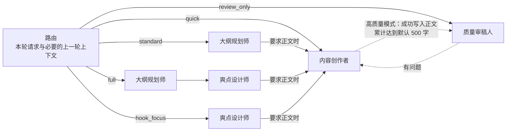

<p align="center">
  
</p>

<h1 align="center">ZenStory 工作台</h1>

<p align="center">
  <b>对话即创作：在浏览器里写小说，AI 直接新建、改写你的大纲、正文和角色卡。</b>
</p>

<p align="center">
  <a href="https://zenstory.ai/zh/workbench"><b>项目主页</b></a>
  &nbsp;·&nbsp;
  <a href="#开始使用"><b>开始使用</b></a>
  &nbsp;·&nbsp;
  <a href="#工作台核心功能"><b>核心功能</b></a>
  &nbsp;·&nbsp;
  <a href="README_EN.md"><b>English</b></a>
</p>

<p align="center">
  <a href="https://github.com/zenstory-ai/zenstory/stargazers"></a>
  
  <a href="https://app.zenstory.ai/"></a>
  <a href="./LICENSE"></a>
</p>

<p align="center">
  <a href="https://app.zenstory.ai/"></a>
  <a href="https://github.com/zenstory-ai/zenstory/issues"></a>
</p>

> **在线使用：[app.zenstory.ai](https://app.zenstory.ai/)，注册或登录后即可创作。**


工作区从左到右依次是文件树、编辑器和 AI 对话。

## 这是什么

ZenStory 工作台是一个面向长篇小说、短篇小说和短剧剧本的浏览器写作环境。大纲、正文、角色卡、设定、素材都是项目里的文件；你在右侧和 AI 对话，AI 直接新建或改写这些文件，无需在聊天窗口和文档软件之间来回复制粘贴。可以在 [app.zenstory.ai](https://app.zenstory.ai) 在线使用，也可以按 AGPL-3.0 许可自己部署。

- **在对话里直接改文件**：说「帮我建一个反派，性格阴沉，有悲情过往」，Agent 会在「角色」文件夹里新建角色卡，边写边流式显示在编辑器里；续写、改写章节同样直接落盘。
- **一个路由，四个专职 Agent**：按请求范围由大纲规划师、爽点设计师、内容创作者、质量审稿人接力——只要求规划就停在规划，明确要求写正文才动笔。
- **改稿有版本可查**：AI 每次改稿都记录独立的「AI 编辑」版本，可在对话卡片一键撤销，也能在文件历史中任选两个版本逐行对比或回滚。
- **每轮自动组装项目上下文**：自动带上「AI 记忆」、项目文件清单、当前打开的章节、相邻章节以及最近修改的角色和设定，不靠翻长聊天记录记设定。
- **支持外部 Agent 接入**：生成 API Key 后，通过 `npx zenstory` 命令行与标准技能包，Claude Code、Codex、OpenClaw 等外部 Agent 也能直接读写你的项目。

## 开始使用

### 在线使用

打开 [app.zenstory.ai](https://app.zenstory.ai) 注册即可，不需要邀请码。免费版包含每天 3 条 AI 消息（北京时间 00:00 重置）、最多 3 个项目，各套餐对比见[定价页](https://app.zenstory.ai/pricing)。

新建一个「长篇小说」项目后，第一条请求可以先让 AI 规划「黄金三章」细纲，确认节奏后再动笔写正文：

> 我想写一本玄幻爽文，先规划黄金三章细纲，暂不写正文。男主萧无涯是诸天万界最大的商会之主，十年来倾尽灵石、极品丹药和护山大阵把青云女帝洛清寒捧上神坛。开篇女帝证道大典，她为了刚入门的剑道白月光叶尘，当众嘲讽萧无涯满身铜臭、不配与她并肩，直接将他逐出宗门。萧无涯当场笑纳，一键切断宗门所有灵石、丹药和阵法供应。请按黄金三章给出每章的核心冲突、打脸爽点和章末卡点钩子。

细纲敲定后，再让 AI 落盘并写正文（第三行的「钩子设计：」需先在「技能 → 发现技能」里启用该技能）：

```text
把刚才的黄金三章细纲存进「大纲」文件夹，命名为「黄金三章细纲」。
按「黄金三章细纲」写第一章，存进「正文」文件夹里的「第1章 铜臭味？那就断了你的成仙路」，写完这一章就停。
钩子设计：只改「第1章 铜臭味？那就断了你的成仙路」最后两段，卡在护山大阵灵力归零、全宗长老傻眼的瞬间。
```

更多用法见[使用文档](https://zenstory.ai/docs)。

### 自己部署

```bash
export DEEPSEEK_API_KEY=your-key          # 也可以写进仓库根目录的 .env
docker compose up -d --build

# 创建首个管理员账号（无需邀请码和邮箱验证，密码至少 12 位）
docker compose exec -e ZENSTORY_ADMIN_EMAIL=you@example.com \
  -e ZENSTORY_ADMIN_PASSWORD='CHANGE-ME-12CHARS' server python scripts/create_admin.py
```

打开 <http://localhost:5173> 登录，API 文档在 <http://localhost:8000/docs>。默认使用 SQLite，数据库与上传文件保存在 Docker 卷中，`docker compose down` 和重新构建不会丢失数据。

- **写作配置**：项目系统提示词（`novel`、`short`、`screenplay`）和官方技能保存在数据库中，首次启动后请在管理后台配置并重新加载，维护方式见 [docs/agent-writing-guidance.md](docs/agent-writing-guidance.md)。
- **套餐额度**：新账号（含管理员）默认为免费套餐（每天 3 条 AI 消息、最多 3 个项目）。需要更多额度时，运行 `docker compose exec server python scripts/seed_subscription_plans.py` 初始化套餐，再从管理后台「订阅管理」给账号开通 Pro。
- **完整部署与可选功能**：PostgreSQL + Redis 生产部署、免邀请码注册、积分与邀请开关、邮箱验证码（Resend）、主备模型（DeepSeek / MiniMax）、Google 登录、腾讯云语音输入、素材拆解（Prefect Worker）、灵感库以及支付宝 Zpay 收款等配置，详见 [docs/docker-compose.md](docs/docker-compose.md)。

<details>
<summary>不用 Docker，本地开发</summary>

需要 Node.js 20.19+、Python 3.12 和 pnpm：

```bash
# 终端 1：后端（端口 8000）
cd apps/server
python3 -m venv venv && source venv/bin/activate
pip install -r requirements.txt
cp .env.example .env          # 填上 DEEPSEEK_API_KEY
python3 main.py

# 终端 2：前端（端口 5173）
cd apps/web
pnpm install
cp .env.example .env.local
pnpm dev
```

首个账号同样在 `apps/server` 下带上 `ZENSTORY_ADMIN_EMAIL` 和 `ZENSTORY_ADMIN_PASSWORD` 运行 `python scripts/create_admin.py` 创建。

</details>

### 接入外部 Agent（Claude Code / Codex / OpenClaw）

在工作台「设置 → Agent」里创建 API Key，然后在终端运行（需要 Node.js 20+）：

```bash
npx zenstory login           # 按提示粘贴 Key（隐藏输入，不进 shell 历史；自托管加 --api-base https://你的服务器/api/v1）
npx zenstory skill install   # 默认装到 Claude Code；Codex、OpenClaw 加 --target codex / --target openclaw
npx zenstory whoami          # 确认登录状态和读写权限
```

装好技能后，外部 Agent 使用自己的模型写作，通过 `zenstory` CLI 读取上下文并写回章节：

```bash
dir=$(mktemp -d)
zenstory files list <项目ID> --type draft --fields id,title --json           # 列出草稿（顺序与工作台文件树一致）
zenstory context <项目ID> --file <章节ID> --query "接下来写什么" --json        # 获取组装好的项目上下文
zenstory files get <章节ID> --fields updated_at --json                       # 记录当前版本时间戳
zenstory files get <章节ID> -o "$dir/<章节ID>.md"                            # 导出到本地临时文件
zenstory files put <章节ID> --content-file "$dir/<章节ID>.md" --if-updated-at <updated_at>   # 校验无并发冲突后写回
```

完整命令与 HTTP 接口说明见 [apps/cli/README.md](apps/cli/README.md) 及 <https://api.zenstory.ai/skill.md>。

## 工作台核心功能

<table>
  <tr>
    <td></td>
    <td></td>
  </tr>
  <tr>
    <td align="center">打开章节，在右边写请求</td>
    <td align="center">长篇项目默认五个文件夹：设定、角色、素材、大纲、正文</td>
  </tr>
</table>

### 多 Agent 分工


```mermaid
flowchart LR
    R["路由<br/>本轮请求与必要的上一轮上下文"] -->|quick| W["内容创作者"]
    R -->|standard| P["大纲规划师"] -->|要求正文时| W
    R -->|full| P2["大纲规划师"] --> H["爽点设计师"] -->|要求正文时| W
    R -->|hook_focus| H2["爽点设计师"] -->|要求正文时| W
    R -->|review_only| Q["质量审稿人"]
    W -. 高质量模式：成功写入正文累计达到默认 500 字 .-> Q
    Q -. 有问题 .-> W
```

| 流程 | 谁来做 | 触发场景 |
| --- | --- | --- |
| `quick` | 内容创作者直接写 | 续写、扩写等日常请求，路由拿不准时也走这条 |
| `standard` | 先规划；同时要求正文时再写 | 要大纲、规划、梗概、章节结构 |
| `full` | 规划 → 爽点设计 → 写作 | 明确要完整流程、重要章节或高潮戏 |
| `hook_focus` | 先设计爽点、反转或节奏；要求改稿时再写 | 觉得不够爽、太平淡、要加反转 |
| `review_only` | 只审稿，不改文件 | 要检查问题、评估质量或看追更指数 |

- **「高质量」与「快速」模式**：两者使用同一个模型。「高质量」默认经过路由分工，并在成功写入的正文累计达到 500 字时自动交由审稿人核对作者要求、事实连续性与因果（每次请求最多两轮审查）；「快速」跳过路由和按字数自动送审，直接交给内容创作者。
- **生成中追加指令**：AI 写作过程中可继续在输入框发送补充要求。当前正在执行的 Agent 不会被中途打断，本轮结束后由下一个接力的 Agent 或当前 Agent 补一轮处理。

### 14 个内置技能与自定义技能

| 分类 | 技能 |
| --- | --- |
| 写作 | 续写正文 · 开头生成 · 短篇写作 · 短剧剧本正文生成 |
| 情节 | 创建大纲 · 钩子设计 · 短剧改编分析 · 短剧故事概要生成 · 短剧分集集纲生成 |
| 文风 | 润色修改 · 节奏控制 · 去AI味 |
| 角色 | 创建角色 |
| 世界观 | 世界观设定 |

在「技能 → 发现技能」启用后，AI 每轮会先看到已启用技能的名称与用途，按需加载完整方法；你也可以在输入框输入 `/` 或从侧栏点选技能，显式附加到当前消息（最多 3 个）。自定义技能采用开放 Agent Skills 的 `SKILL.md` 格式（可附 `references/` 资源），支持 `.zip` / `.md` 导入导出。

### AI 记忆、上下文与素材库

- **双 32,000 token 上下文预算**：每轮对话除了携带最近约 32,000 token 的聊天记录与刚读写过的文件全文外，还会用独立的约 32,000 token 预算组装项目资料——包含「AI 记忆」四栏（项目简介、写作风格、当前阶段、备注）、项目文件清单、当前编辑文件、同文件夹的上一章与近期修改文件，以及近期修改的角色和设定。需要长期记住的核心设定请简明写进「AI 记忆」，细节放进角色卡和设定文件；AI 对备注的更新会作为提议呈现，由你确认是否保留。
- **参考小说素材库**：上传一本 TXT 参考小说（不超过 30 万字），后台自动拆出每章摘要、全书概要、角色档案、世界观和金手指。AI 不会自动去翻素材库；需要参考时，在项目的「参考小说库」面板把条目「附加到聊天」（每条消息最多 5 个），或直接导入项目成为可检索的文件。在线版完整素材库为 Pro 权益（启用免费试拆的环境会按页面提示提供一次开篇试拆）。

### 版本历史与章节导出


- **文件版本与撤回**：停笔约 3 秒自动保存；10 分钟内的连续手动保存自动合并到最近的手动版本。AI 对话改稿单独记为「AI 编辑」版本（不占手动版本名额），可在对话卡片点「撤销」，或在编辑器底部「历史」任选两个版本逐行对比、回滚（回滚前会自动备份当前未入历史的稿件）。在编辑器内选中文字点击「去AI味」时，改写结果会按段落对比展示，逐段接受或拒绝后才保存。
- **旧稿导入、自动排序与导出**：在「正文」文件夹旁点「+」（上传正文），单次最多上传 20 个 `.txt` 或 `.md` 文件（单个不超过 5MB、50 万字），包含两个以上「第X章」「卷X」「序章」「楔子」「番外」「Chapter N」等标题时会自动拆成多个章节文件。文件树和「导出正文」都能正确混排中文与阿拉伯数字序号（如 `第一章` → `第2章` → `第十章` → `第一百零二章`；无序号的「序章」若在空文件夹中第一个创建则排在最前）。点击「导出正文」即可按章节顺序将正文和剧本合成为单个带 UTF-8 BOM 的 TXT 文件；大纲、角色卡和设定可打开文件后用「下载当前文件」单独保存。

### 其他特性

- **三种项目类型**：新建项目可选长篇小说、短篇小说或短剧剧本，各自带有对应的默认文件夹结构与专属写作指引。
- **快捷搜索与语音输入**：按 `Cmd+K`（Windows 为 `Ctrl+K`）按标题搜索项目文件；对话框内置语音输入（腾讯云一句话识别）。
- **多端与多语言**：支持中英文界面与深浅色主题切换；手机浏览器自动切换为底部「文件 / 编辑 / AI」三标签布局。

## 常见问题

### 只想和 AI 讨论、不想让它改文件怎么办？

在请求里写明「暂不创建或修改文件」，路由识别为只读请求后会禁用文件写入工具。如果 AI 已经修改了文件，直接在对话的编辑卡片上点「撤销」，或打开编辑器底部的「历史」回滚到上一版本即可。

### 能换别的大模型吗？

自托管环境可以用环境变量在 DeepSeek 和 MiniMax 之间配置主用与备用模型：`LLM_PRIMARY_PROVIDER` / `LLM_PRIMARY_MODEL`、`LLM_BACKUP_PROVIDER` / `LLM_BACKUP_MODEL`，Key 分别为 `DEEPSEEK_API_KEY`、`MINIMAX_API_KEY`。主用不可用（连不上、超时、限流、5xx、Key 失效）时，当前会话窗口自动切换到备用。完整说明见 [`apps/server/agent/core/llm_providers.py`](apps/server/agent/core/llm_providers.py)（新增模型需先在 `apps/server/services/usage/pricing.py` 配置价格）。

### 能导出 Word，或者直接发布到小说平台吗？

目前「导出正文」生成单个带 BOM 的 UTF-8 TXT 文件（`项目名_正文.txt`，Windows 记事本可直接打开）。需要 Word 排版或发布到小说平台时，请将该 TXT 导入本地软件或手动上传（[#13](https://github.com/zenstory-ai/zenstory/issues/13)）。

### 自托管怎么放开注册？忘记密码怎么办？

自托管默认要求邀请码注册（管理员在后台「邀请系统」生成）；如需免邀请码注册，在后端配置 `AUTH_REGISTER_INVITE_CODE_OPTIONAL=true`（前端可选加 `VITE_INVITE_CODE_OPTIONAL=true`），详见 [docs/docker-compose.md](docs/docker-compose.md)（[#1](https://github.com/zenstory-ai/zenstory/issues/1)）。在线版暂未开放自助重置密码，忘记密码请使用注册邮箱发信至 `support@zenstory.ai`。

## 延伸阅读

- [快速开始](https://zenstory.ai/docs/getting-started/quick-start)：从空项目到第一份能改的提纲。
- [第一篇短篇](https://zenstory.ai/docs/getting-started/first-project)：一个原创短篇的文件安排和三段范围明确的请求。
- [AI 创作助手](https://zenstory.ai/docs/user-guide/ai-assistant)：焦点文件、引用文字，以及中断后怎么接着写。
- [AI 记忆](https://zenstory.ai/docs/advanced/ai-memory)：四栏怎么填，写错了怎么改。
- [版本历史](https://zenstory.ai/docs/user-guide/version-history)：查看、比较和恢复单个文件的版本。
- [从参考片段写到自己的场景](https://zenstory.ai/docs/advanced/material-analysis)：拆完参考小说，怎样写出自己的戏。
- [写作环境对比](https://zenstory.ai/zh/compare/writing-workflows)：普通聊天、Oh Story skill 包、DSH 插件和 ZenStory 工作台各适合什么。
- [AI 续写怎么保持文风](https://zenstory.ai/zh/oh-story/preserve-author-voice)：把文风拆成说得清的几点，附一段自己的样本。

## 参与贡献

- **GitHub Issues**：[提交 Bug](https://github.com/zenstory-ai/zenstory/issues/new?template=bug_report.md) · [功能建议](https://github.com/zenstory-ai/zenstory/issues/new?template=feature_request.md)。在线版也可以从项目页右上角「…」→「问题反馈」提交并附截图。
- 改代码前请先阅读 [CONTRIBUTING.md](CONTRIBUTING.md) 与仓库文档索引 [docs/README.md](docs/README.md)。写作 Agent 的工作流、工具和 SSE 事件说明见 [`apps/server/agent/AGENTS.md`](apps/server/agent/AGENTS.md)。

<details>
<summary>项目结构与技术栈</summary>

```text
zenstory/
├── apps/web/                 # React 前端
│   ├── src/components/       #   Layout、sidebar/FileTreePane、Editor、ChatPanel、skills …
│   ├── src/pages/            #   Dashboard、项目、素材库、定价 …
│   └── docs/                 #   使用文档源文件，发布到 zenstory.ai/docs
├── apps/cli/                 # zenstory 命令行工具与外部 Agent 技能包
└── apps/server/              # FastAPI 后端
    ├── api/                  #   路由：auth、projects、files、agent、agent_api、materials、admin …
    ├── agent/                #   写作 Agent
    │   ├── graph/            #     路由、交接、自动审稿的调度循环
    │   ├── tools/            #     文件、项目、技能和交接工具
    │   ├── context/          #     每轮上下文的组装、预算和优先级
    │   ├── prompts/          #     共享协议与角色提示，项目写作配置在数据库
    │   └── skills/           #     技能加载与注入，官方技能正文在数据库
    ├── flows/                #   素材拆解流水线（Prefect）
    ├── services/             #   业务逻辑
    └── models/               #   数据模型
```

| 层 | 技术 |
| --- | --- |
| 前端 | React 19 · TypeScript · Vite 7 · Tailwind CSS 4 · Zustand · TanStack Query |
| 后端 | FastAPI · SQLModel · Server-Sent Events |
| AI | DeepSeek `deepseek-flash`（默认，可配 DeepSeek / MiniMax 主备切换）· openai-agents-python |
| 检索 | 数据库关键词匹配、相关片段与行号；文件编辑后立即可搜，无索引任务 |
| 数据 | SQLite（默认）/ PostgreSQL · Redis · Alembic |
| 部署 | Docker Compose；在线版前端在 Vercel，后端与 Prefect 在 Railway |

</details>

## 许可证

[GNU AGPL-3.0](LICENSE) &copy; 2024-2026 ZenStory

本仓库采用 GNU Affero General Public License v3.0。你可以自由使用、修改和自部署；如果把修改后的版本作为网络服务提供给他人，需要按 AGPL 向这些用户公开对应的源代码。

ZenStory 名称与标识不在许可范围内：fork 或自部署的服务请使用自己的名称。需要商业授权（不受 AGPL 义务约束）请联系维护者。

`apps/cli` 命令行客户端仍按 MIT 许可提供，见 [apps/cli/LICENSE](apps/cli/LICENSE)。

## ZenStory AI 项目

ZenStory 工作台由 [ZenStory AI](https://zenstory.ai/zh) 维护——一套可在 AI Agent 中使用的开源故事创作、改编与制作工具（GitHub 组织：[zenstory-ai](https://github.com/zenstory-ai)）。同组织项目：

| 项目 | 用途 |
| --- | --- |
| [oh-story-claudecode](https://github.com/zenstory-ai/oh-story-claudecode) | 网文写作 skill 包：扫榜、拆文、写作、去AI味、封面图 |
| [drama-skills](https://github.com/zenstory-ai/drama-skills) | AI 短剧 / 漫剧创作 skill 合集：剧本、资产、分镜、图片/视频提示词、独立审查 |
| [novel-to-game](https://github.com/zenstory-ai/novel-to-game) | 小说改编游戏 skill 合集：原著拆解、目标运行环境构建与实机运行验收 |
| [video-recap-skills](https://github.com/zenstory-ai/video-recap-skills) | 将支持的视频文件制作成中文解说，可选导出可编辑的剪映/CapCut 草稿 |
| [oh-story-dsh](https://github.com/zenstory-ai/oh-story-dsh) | DeepSeek Harness 社区插件，提供小说、短剧、游戏和视频解说工作台 |
| [zenstory](https://github.com/zenstory-ai/zenstory) | 对话即创作的 AI 小说写作工作台，在线版 [app.zenstory.ai](https://app.zenstory.ai)（本仓库） |
