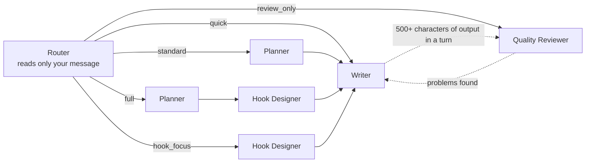

<!-- Last synced with README.md: 2026-09-24 -->

<p align="center">
  
</p>

<h1 align="center">ZenStory Workbench</h1>

<p align="center">
  <b>Chat to create: write fiction in your browser while the AI creates and edits your outlines, chapters and character sheets.</b>
</p>

<p align="center">
  <a href="https://zenstory.ai/workbench"><b>Project page</b></a>
  &nbsp;·&nbsp;
  <a href="#get-started"><b>Get started</b></a>
  &nbsp;·&nbsp;
  <a href="#see-what-it-produces"><b>See what it produces</b></a>
  &nbsp;·&nbsp;
  <a href="README.md"><b>中文</b></a>
</p>

<p align="center">
  <a href="https://github.com/zenstory-ai/zenstory/stargazers"></a>
  
  <a href="https://app.zenstory.ai/"></a>
  <a href="./LICENSE"></a>
</p>

<p align="center">
  <a href="https://app.zenstory.ai/"></a>
  <a href="https://github.com/zenstory-ai/zenstory/issues"></a>
</p>


File tree on the left, editor in the middle, AI chat on the right.

## What it is

ZenStory Workbench is a place to write fiction in the browser. Outlines, chapters, character sheets, world-building notes and reference material are all files in a project. You talk to the AI on the right, and it creates and edits those files directly, with no copy-paste in between. Use it online at [app.zenstory.ai](https://app.zenstory.ai), or host it yourself under the MIT license.

- **Edit files from the chat**: ask for "a villain, brooding, with a tragic past" and the Agent creates a character sheet in the Characters folder, streaming it into the editor as it writes. Continuing or rewriting a chapter works the same way: the change lands in the file.
- **One router, four specialist agents**: the router reads only your message and picks one of five paths; then the Planner, Hook Designer, Writer and Quality Reviewer take turns. Once the Writer's output in a turn reaches 500+ characters and it has written to a file, the reviewer is called automatically. The reviewer has no file-editing tools and sends problems back for a rewrite.
- **Every edit from the chat leaves a version**: each edit the in-app AI makes to a file saves a version, and the edit card in chat has a one-click Undo. Your own saves record a version only when the text length changes by more than 10 characters. When an AI reply finishes normally, the whole project gets a snapshot.
- **Each turn carries the right material**: within a budget of about 6,000 tokens the AI gets the four AI Memory fields (Project Summary, Writing Style, Current Phase, Notes; long ones are shortened), the project's file list, the file you are editing, the previous chapter and a few recently edited files from the same folder, and recently edited characters and lore.
- **Other agents can plug in**: generate an API key in Settings, send the prompt to an agent such as Claude Code or OpenClaw, and it can read and write your projects.

## What's in the workbench

<table>
  <tr>
    <td></td>
    <td></td>
  </tr>
  <tr>
    <td align="center">A chapter open, with a request typed on the right</td>
    <td align="center">A novel project starts with five folders (Chinese UI shown; in English: World Building, Characters, Materials, Outlines, Drafts)</td>
  </tr>
</table>

### Multi-agent roles



| Path | Who works | When it runs |
| --- | --- | --- |
| quick | the Writer writes directly | everyday continuing and expanding; also the fallback when the router is unsure |
| standard | outline first, then write | you ask for an outline, plan, synopsis or chapter structure |
| full | outline → hook design → write | you explicitly ask for the full treatment, a key chapter or a climax |
| hook_focus | design payoffs, twists and pacing, then write | you say it's flat, not satisfying enough, or needs a twist |
| review_only | review only, no edits | you ask for a check, an assessment or a read-on score |

The input box switches between Quality and Fast mode; both use the same model. Quality, the default, runs the router and the length-based automatic review. Fast skips the router and that automatic review and goes straight to the Writer, whose own prompt still tells it to hand drafts over 500 characters to the reviewer, so a review can still happen.

While the AI is working you can type a follow-up instruction. The agent that is running doesn't see it during its current run; when that run ends, the next agent picks it up, or, if none is planned, the same agent gets one more round to act on it. What is being written is not interrupted.

### 13 built-in skills

The skill names are Chinese in the product; the file ids are given here.

| Category | Skills |
| --- | --- |
| Writing | 续写正文 `continue-writing` · 场景描写 `describe-scene` · 对话生成 `generate-dialogue` · 开头生成 `generate-opening` |
| Plot | 创建大纲 `create-outline` · 冲突设计 `design-conflict` · 钩子设计 `hook-design` · 反转设计 `reversal-design` |
| Style | 代入感强化 `immersion-enhance` · 润色修改 `polish-text` · 节奏控制 `rhythm-control` |
| Character | 创建角色 `create-character` |
| Worldbuilding | 世界观设定 `worldbuilding` |

Each skill is a Markdown file in [`apps/server/agent/skills/builtin/`](apps/server/agent/skills/builtin/) with its trigger words and the instructions the AI receives. Add a skill under Skills → Discover, then use it: type `/` in the input box and pick it, or start your message with the skill's name or trigger followed by a space or punctuation (for example 「钩子设计：给这章换个结尾」), and that message follows the skill. If you name none, the AI may apply a skill by itself, but each turn carries the full instructions of only a few enabled skills (about 4,000 characters in total); the rest take effect only when you name them at the start of a message. You can write your own skills too; shared skills go public after an admin approves them.

### Versions, snapshots and export


- Autosave runs about 3 seconds after you stop typing. A version is recorded when the text length changes by more than 10 characters; each AI edit records its own version, labelled AI Edited.
- The History button at the bottom of the editor opens the current file's versions: compare any two line by line, or roll the file back. Rollback deletes no versions; while the file's version allowance has room, the restored text is recorded as a new version. The text being replaced is not saved first, so check that it already has a version.
- The history icon in the top bar (tooltip: Version History) lists whole-project snapshots. Compare two snapshots, or roll the whole project back to one. A snapshot points at each file's latest version instead of copying its text, so edits that never became a version are lost on rollback, and a full rollback also removes files created after the snapshot.
- Export Manuscript merges the project's chapter and script files into one TXT in chapter order; outlines, character sheets and lore are left out.

### Material library and inspiration library

- **Material library**: upload a reference novel as TXT (up to 300,000 characters) and the backend extracts per-chapter summaries, plot points for each chapter, character profiles, cross-chapter arcs and storylines, the world setting, and cheat abilities (金手指, the protagonist's special edge). The AI does not browse the library on its own; attach entries to the chat or import them into the project (see the [FAQ](#does-the-ai-consult-my-material-library-automatically)). On the hosted service the material library is a Pro feature.
- **Inspiration library**: complete project templates, either published by the admins or submitted by users and approved by an admin. Use This Template creates a new project with a copy of every file in the template.

### Also

- A project is a Long-form Novel, Short Story or Screenplay (short drama); each type has its own starter folders and its own writing brief for the AI.
- Import a manuscript you've already written; it is split into chapter files at the headings (see the [FAQ](#can-i-bring-in-a-manuscript-ive-already-written)).
- `Cmd+K` (`Ctrl+K` on Windows) searches file titles in the project.
- The chat box has voice input (Tencent Cloud ASR); the recognized text lands in the input box.
- Chinese and English interfaces; dark and light themes are switched in Settings; on a phone browser the workbench becomes three bottom tabs, Files / Editor / AI.

## Get started

### Hosted

Open [app.zenstory.ai](https://app.zenstory.ai). Sign-up asks for an invite code; ask someone who already has an account to generate one under Settings → Referral (see the [FAQ](#sign-up-on-the-hosted-app-asks-for-an-invite-code-where-do-i-get-one)). The free plan includes 20 AI conversations a day and 3 projects; the [pricing page](https://app.zenstory.ai/pricing) compares the plans.

Create a Short Story project. A good first request asks for an outline you can edit rather than a chapter (the example comes from the [quick start](https://zenstory.ai/docs/getting-started/quick-start#en); the English docs are below the Chinese on each page):

> Plan a realistic mystery short story as a three-scene outline only. Do not write prose or create or modify files. It is 5:40 p.m.; the station lost-property desk closes at six. Lin He handles Shen Min's claim for a gray canvas bag. She describes its exterior correctly but names the wrong object in its inner pocket. Do not conclude that she stole it or decide the truth. Lin He cannot release the bag on a verbal claim alone. For each scene, give the location, immediate goal, visible action, information change and closing question. End with two choices for me to decide, then stop.

Once the outline is settled, name the files and let it write (the third line needs the 钩子设计 skill added under Skills → Discover first):

```text
Save the three-scene outline as "Lost and Found outline" in the Concept folder.
Following "Lost and Found outline", write scene one as "Scene 1: The Claim" in the Drafts folder and stop after that scene.
钩子设计：rewrite only the last two paragraphs of "Scene 1: The Claim" so it ends on a stronger hook.
```

The [docs](https://zenstory.ai/docs#en) cover the rest.

### Self-hosted

You need Docker and a [DeepSeek API key](https://platform.deepseek.com/api_keys):

```bash
export DEEPSEEK_API_KEY=your-key          # or put it in a .env file at the repo root
docker compose up -d --build

# First account: an admin, no invite code or email verification.
# Use your own email and a password of 12+ characters (CHANGE-ME is too short and is rejected)
docker compose exec -e ZENSTORY_ADMIN_EMAIL=you@example.com \
  -e ZENSTORY_ADMIN_PASSWORD='CHANGE-ME' server python scripts/create_admin.py

# Optional: load the 13 built-in skills into Skills → Discover
docker compose exec server python scripts/migrate_skills.py --db-url sqlite:////app/db/zenstory.db
```

Sign in at <http://localhost:5173>; the API reference is at <http://localhost:8000/docs>. The database is SQLite and lives in a Docker volume together with uploads and the vector index, so `docker compose down` and image rebuilds keep your data.

Every account, the admin included, starts on the free plan: 20 AI conversations a day and up to 3 projects. To lift that, run `docker compose exec server python scripts/seed_subscription_plans.py` to create the Pro plan (it also creates the free-plan row), then give an account Pro under Subscriptions in the admin console, or raise the free plan's limits under Subscription Plans.

The writing agents use DeepSeek `deepseek-v4-flash` and need only that key. Other features need their own settings. With the quick start above, add backend variables under `server.environment` in `docker-compose.yml` and `VITE_*` variables under `web.environment`, then run `docker compose up -d`; the repo-root `.env` only fills the `${…}` placeholders in the compose file (such as `DEEPSEEK_API_KEY` and `JWT_SECRET_KEY`) and passes nothing else into the containers. With `docker-compose.full.yml`, put them in `apps/server/.env.docker` and `apps/web/.env.docker` instead.

<details>
<summary>Settings for optional features</summary>

| Feature | Settings |
| --- | --- |
| Semantic search in a project (the Agent's `hybrid_search` and the related snippets added each turn) | `ZHIPU_EMBEDDINGS_API_KEY` |
| Letting other people sign up | invite codes are required by default; an admin generates them under Settings → Referral. To drop them, set `AUTH_REGISTER_INVITE_CODE_OPTIONAL=true` |
| Verification codes for email sign-up | `REDIS_URL`, `RESEND_API_KEY`, `RESEND_FROM_EMAIL`; the quick start has no Redis, so use `docker-compose.full.yml` |
| Staying signed in across restarts | `JWT_SECRET_KEY` (32+ characters; with the quick start it can go in the root `.env`) |
| Voice input | `TENCENT_SECRET_ID`, `TENCENT_SECRET_KEY` |
| Google sign-in | backend `GOOGLE_CLIENT_ID`, `GOOGLE_CLIENT_SECRET`, `GOOGLE_REDIRECT_URI`, `FRONTEND_URL`; frontend `VITE_GOOGLE_OAUTH_ENABLED=true` |
| Material-library decomposition | a separate Prefect server and worker (see [`apps/server/prefect.yaml`](apps/server/prefect.yaml)), and the material library enabled on the plan |
| Connecting outside agents | `API_BASE_URL=http://your-server:8000/api/v1` (the backend address); the prompt copied from Settings points at `https://api.zenstory.ai/skill.md`, so change it to `http://your-server:8000/skill.md` before sending it |
| Redemption codes | `REDEMPTION_CODE_HMAC_SECRET` (32+ characters), with the Pro plan created first |

</details>

<details>
<summary>Local development without Docker</summary>

You need Node.js 20.19+, Python 3.12 and pnpm:

```bash
# Terminal 1: backend (port 8000)
cd apps/server
python3 -m venv venv && source venv/bin/activate
pip install -r requirements.txt
cp .env.example .env          # set DEEPSEEK_API_KEY
python3 main.py

# Terminal 2: frontend (port 5173)
cd apps/web
pnpm install
cp .env.example .env.local
pnpm dev
```

Create the first account with `scripts/create_admin.py` as well (run it from `apps/server` with `ZENSTORY_ADMIN_EMAIL` and `ZENSTORY_ADMIN_PASSWORD` set). Optional settings go in `apps/server/.env` and `apps/web/.env.local`.

</details>

For PostgreSQL + Redis, more accounts, other ports and similar details, see [docs/docker-compose.md](docs/docker-compose.md) (in Chinese).

## See what it produces

The first section is the Writer agent's own instructions. The other two come from a real run: a clean checkout started with the [Self-hosted](#self-hosted) steps above, and a novel project called 失物招领 (Lost and Found) created through the API. The chapter titles and text were typed in as test data; the run did not call the AI. Omissions are marked "……".

### What the Writer agent is told to avoid

The Writer's prompt ([`apps/server/agent/prompts/subagents.py`](apps/server/agent/prompts/subagents.py)) has a section on writing that doesn't read like AI. An excerpt, in the original Chinese:

```markdown
### 禁用词汇
绝对禁止使用以下AI高频词汇：
- 仿佛、好像、犹如、一丝、一抹
- 深吸一口气、缓缓、不禁
……
### 正确替代示例
- ❌ '他感到一丝愤怒' → ✅ '他攥紧了拳头'
- ❌ '她的眼中闪过一抹惊讶' → ✅ '她愣了一下'
- ❌ '"你好。"他说道' → ✅ '"你好。"他点了点头'
```

It bans stock phrases such as "as if", "a trace of", "took a deep breath" and "slowly", and gives replacements: "he felt a trace of anger" becomes "he clenched his fists"; "surprise flashed in her eyes" becomes "she froze for a second"; a bare "he said" becomes a gesture. The same prompt sets chapters at 2,000–3,000 characters and has them end on an action, a line of dialogue or suspense, never a summary like "that day he learned a lot".

### Chapters sort by the number in the title, and export follows

Five files were created in the 正文 (Drafts) folder in this order: chapter ten, the prologue (序章), chapter 2, chapter one, chapter one hundred and two. The file tree returned:

```text
第一章 五点四十分
第2章 灰色帆布包
第十章 六点关门
序章
第一百零二章 尾声
```

Chinese and Arabic numerals mix fine. The prologue has no number, so it goes after whatever files existed when it was created, which put it after chapter ten; create it while the folder is still empty if you want it first (checked in a second project: prologue, chapter one, chapter 2).

Export Manuscript merges them into one TXT in the same order. It starts like this:

```text
第一章 五点四十分

五点四十分，林禾把登记簿翻到今天那一页。
沈敏说包是灰色的帆布包，内袋里有一把折叠伞。
窗口六点关。

---

第2章 灰色帆布包

第2章的正文。

---
……
```

### Connecting Claude Code

After you create a key under Settings → Agent, a dialog shows a prompt to send to your agent (in an English UI; the key is replaced with a placeholder here; if you self-host, first change both URLs to your server as in the table above):

```text
Read https://api.zenstory.ai/skill.md to learn about my novel writing platform API, then connect with this API key:
API Key: eg_……
Header: X-Agent-API-Key: eg_……

After connecting, verify by calling GET https://api.zenstory.ai/skill.md.
```

`skill.md` (the English version is at `/skill.md?lang=en`) spells out the five steps for continuing a chapter:

```text
1. GET  /agent/projects/{id}/files?file_type=draft&fields=id,title  → List drafts
2. GET  /agent/files/{file_id}                                        → Read current content
3. GET  /agent/projects/{id}/writing-context?file_id={file_id}     → Get relevant context
4. POST /agent/projects/{id}/search  query="character relationships"  → Search character relations
5. PUT  /agent/files/{file_id}                                        → Update draft content
```

Step 1 with that key returns the chapters above, in the file-tree order:

```json
{
 "files": [
  { "id": "9f079009-2732-4230-9d2c-2c9caf48d10a", "title": "第一章 五点四十分" },
  { "id": "76099953-a196-47c5-a38a-6e88c2632050", "title": "第2章 灰色帆布包" },
  ……
 ],
 "total": 5,
 "limit": 50,
 "offset": 0
}
```

The agent writes with its own model; ZenStory stores the manuscript and assembles context. What it writes back in step 5 replaces the whole file and leaves no version in the history, so use Export Manuscript to keep a copy of the current draft before letting it revise.

## FAQ

### Sign-up on the hosted app asks for an invite code. Where do I get one?

From someone who already has an account: under Settings → Referral they click Generate Code. Each person can generate up to 3 codes, and each code works 3 times. The shared link looks like `https://app.zenstory.ai/register?code=XXXX-XXXX` and fills the code in for you. New accounts created with Google need a code too; existing accounts signing in with Google don't. The sign-up page has no way to request a code yet ([#63](https://github.com/zenstory-ai/zenstory/issues/63)).

### On my own server, how do I create the first account, and how do others sign up?

Create the first account with `scripts/create_admin.py`; the command is under [Self-hosted](#self-hosted), and it needs neither an invite code nor email verification. Others need an invite code by default, which an admin generates under Settings → Referral or on the admin console's Referral System page. To drop invite codes, add `AUTH_REGISTER_INVITE_CODE_OPTIONAL: "true"` under `server.environment` in `docker-compose.yml` (in `apps/server/.env` for local development) and run `docker compose up -d`; optionally add `VITE_INVITE_CODE_OPTIONAL: "true"` under `web.environment` so the form shows the code as optional from the start ([#1](https://github.com/zenstory-ai/zenstory/issues/1)). People who sign up by email must receive a verification code before they can sign in, which needs Redis and `RESEND_API_KEY`.

For a few people you trust, you can also run `create_admin.py` again with their email and a new `ZENSTORY_ADMIN_USERNAME` (the default is `admin`; usernames must be unique). Every account made this way is an admin that can open the admin console and change prompts, plans and users; afterwards, edit the account under User Management and clear Superuser.

### Can I use a different model?

Not from a setting. The model name `deepseek-v4-flash` is written in code ([`apps/server/agent/core/deepseek_client.py`](apps/server/agent/core/deepseek_client.py)). `DEEPSEEK_BASE_URL` can point at another OpenAI-compatible endpoint, but requests still name the same model. Support for more models is requested in [#13](https://github.com/zenstory-ai/zenstory/issues/13).

### Can I export to Word, or publish straight to a web-novel platform?

Neither. Export Manuscript produces one TXT: UTF-8 with a BOM, so Windows Notepad opens it directly, named `<project>_正文.txt`. For other formats, lay out that TXT in a local app; publishing to a platform is also a manual upload ([#13](https://github.com/zenstory-ai/zenstory/issues/13)).

### Does the AI ask before it changes my manuscript? How do I undo a bad edit?

It doesn't ask. Edits the Agent makes from chat are saved straight to the file, along with an AI Edited version. The edit card in chat lists each change with before/after snippets, and Undo returns the file to the previous version; you can also open History at the bottom of the editor and roll the file back to any version. If you only want to discuss, say "don't create or change any files" in the request; that is an instruction to the AI, not a read-only switch. Selecting text in the editor and choosing Humanize works differently: the rewrite opens as a paragraph-by-paragraph diff, and it is saved only after you accept or reject each change.

### In a long chat, does the AI still remember what I said at the start?

Not from the chat history. Only the most recent ~6,000 tokens of conversation go to the model each turn; older messages are dropped, not summarized. Project material has a separate budget of about 6,000 tokens: AI Memory, the project's file list, the current file, the previous chapter and a few recently edited files from the same folder, and recently edited characters and lore; a long Project Summary or Notes is shortened, and a large project's file list is cut off. Keep lasting points short in AI Memory and put the details in character and lore files. The AI is also instructed to update AI Memory when you state a genre, style or rule; the tool result in chat, or the AI Memory panel, shows whether it did.

### What's the difference between Fast and Quality mode?

Same model; Fast just skips the router and the length-based automatic review (see [Multi-agent roles](#multi-agent-roles)). The reviewer gives a read-on score from 1 to 10; from the third review round on it is told to pass anything scoring 5 or more, so the loop doesn't go on forever.

### Does the AI consult my material library automatically?

No. To let it read an entry, use Attach to Chat in the project's Novel References panel (up to 5 entries per message), or import it into the project as a file; imported files can be searched like any other project file.

### What does the free plan include?

On the hosted service: 20 AI conversations a day (rolling 24-hour window), up to 3 projects, 10 of your own saved versions per file (after that your text still saves, just without new versions), TXT export, no material library, and each month 3 new custom skills and 10 inspiration-template copies. The free plan does not expire.

### Can I bring in a manuscript I've already written?

Yes. Hover over the Drafts folder and click its + button (Upload Draft): up to 20 .txt or .md files at a time, each up to 5 MB and 500,000 characters. When a file has two or more chapter headings, it is split into separate chapter files at headings such as 第X章, 卷X, 序章, 楔子, 番外 and Chapter N.

### I forgot my password.

There is no self-service reset on the hosted app. Email support@zenstory.ai from the address you registered with.

## Further reading

- [Quick start](https://zenstory.ai/docs/getting-started/quick-start#en): from an empty project to a first outline you can edit.
- [Your first short story](https://zenstory.ai/docs/getting-started/first-project#en): an original short story's file plan and three scoped requests.
- [AI assistant](https://zenstory.ai/docs/user-guide/ai-assistant#en): focused files, quotes, and picking up after an interruption.
- [AI Memory](https://zenstory.ai/docs/advanced/ai-memory#en): what to put in the four fields and how to correct them.
- [Version history](https://zenstory.ai/docs/user-guide/version-history#en): restoring one file versus a whole-project snapshot.
- [From a reference passage to your own scene](https://zenstory.ai/docs/advanced/material-analysis#en): after analysing a reference novel, how to write a scene of your own.
- [Writing environments compared](https://zenstory.ai/compare/writing-workflows): plain chat, the Oh Story skill pack, the DSH plugin and this browser workbench, and what each suits.
- [Keeping your voice when AI continues](https://zenstory.ai/oh-story/preserve-author-voice): describe your voice in concrete terms and give a short sample of your own.

## Contributing

- **GitHub Issues**: [report a bug](https://github.com/zenstory-ai/zenstory/issues/new?template=bug_report.md) · [request a feature](https://github.com/zenstory-ai/zenstory/issues/new?template=feature_request.md). In the hosted app you can also use the "…" menu at the top right of the project page → Feedback, which can attach a screenshot.
- Read [CONTRIBUTING.md](CONTRIBUTING.md) before changing code. The multi-agent workflow, tools and SSE events are described in [`apps/server/agent/CLAUDE.md`](apps/server/agent/CLAUDE.md).

<details>
<summary>Project layout and tech stack</summary>

```
zenstory/
├── apps/web/                 # React frontend
│   ├── src/components/       #   Layout, sidebar/FileTreePane, Editor, ChatPanel, skills …
│   ├── src/pages/            #   Dashboard, project, materials, pricing …
│   └── docs/                 #   docs source, published to zenstory.ai/docs
└── apps/server/              # FastAPI backend
    ├── api/                  #   routes: auth, projects, files, agent, agent_api, materials, admin …
    ├── agent/                #   the writing agents
    │   ├── graph/            #     orchestration loop: routing, handoffs, auto-review
    │   ├── tools/            #     the 9 agent tools
    │   ├── context/          #     per-turn context assembly, budget and priorities
    │   ├── prompts/          #     prompts per project type and per agent
    │   └── skills/           #     skill loading and injection, incl. the 13 built-ins
    ├── flows/                #   material decomposition pipeline (Prefect)
    ├── services/             #   business logic
    └── models/               #   data models
```

| Layer | Technologies |
| --- | --- |
| Frontend | React 19 · TypeScript · Vite 7 · Tailwind CSS 4 · Zustand · TanStack Query |
| Backend | FastAPI · SQLModel · Server-Sent Events |
| AI | DeepSeek `deepseek-v4-flash` (OpenAI-compatible API) · openai-agents-python |
| Retrieval | LlamaIndex · ChromaDB · Zhipu embedding-3, vector and keyword results fused with RRF |
| Data | SQLite (default) / PostgreSQL · Redis · Alembic |
| Deploy | Docker Compose; the hosted app runs the frontend on Vercel and the API plus Prefect on Railway |

</details>

## License

[MIT License](LICENSE) &copy; 2024-2026 ZenStory

## Part of ZenStory AI

ZenStory Workbench is maintained by [ZenStory AI](https://zenstory.ai) — open-source, agent-native tools for creating, adapting and producing stories (GitHub org: [zenstory-ai](https://github.com/zenstory-ai)). Sibling projects:

| Project | What it does |
| --- | --- |
| [oh-story-claudecode](https://github.com/zenstory-ai/oh-story-claudecode) | Web-fiction writing skill pack: chart scanning, deconstruction, drafting, de-AI-flavor, covers |
| [drama-skills](https://github.com/zenstory-ai/drama-skills) | AI short-drama / motion-comic suite: scripts, assets, storyboards, image & video prompts, review |
| [novel-to-game](https://github.com/zenstory-ai/novel-to-game) | Agent skills for source-grounded novel adaptation, target-runtime builds, and evidence-based QA |
| [video-recap-skills](https://github.com/zenstory-ai/video-recap-skills) | Create Chinese-narration recaps from supported video files, with optional editable JianYing/CapCut draft export |
| [oh-story-dsh](https://github.com/zenstory-ai/oh-story-dsh) | Community DeepSeek Harness plugin with novel, short-drama, game and video-recap workbenches |
| [zenstory](https://github.com/zenstory-ai/zenstory) | Chat-to-create AI novel-writing workbench, hosted at [app.zenstory.ai](https://app.zenstory.ai) (this repo) |
